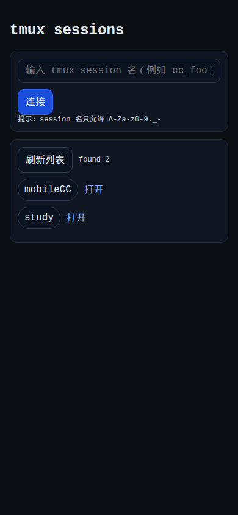
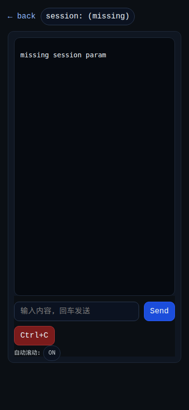

# MobileCC

> 📱 tmux 移动端远程控制工具 - 在手机上轻松管理和操作你的 tmux sessions

MobileCC 是一个基于 Node.js 的 Web 应用，允许你通过手机浏览器远程控制服务器上的 tmux sessions。特别适合在移动设备上监控长时间运行的命令行任务，如 Claude Code 开发会话。

## 💡 项目定位

**MobileCC 是一个专为个人使用设计的轻量级工具，灵感来源于开源项目 [happy](https://github.com/slopus/happy)。**

### ✅ 本项目的目标

- 为个人提供简洁的 tmux 移动端控制方案
- 移动端友好的界面设计
- 实时查看和管理 tmux sessions
- 轻量级部署，无复杂依赖
- 配合 Cloudflare Zero Trust 等安全方案使用

### ❌ 本项目明确不做的

- **多用户系统** - 不支持多用户管理，每个用户部署独立实例
- **权限管理** - 不内置用户认证和权限控制
- **会话隔离** - 所有 tmux sessions 对访问者可见
- **生产级安全** - 安全依赖外部方案（如 Cloudflare Zero Trust）

### 🔒 推荐的安全部署方案

个人使用场景下，建议配合以下方案保护内网安全：

- **Cloudflare Zero Trust / Cloudflare Access** - 提供身份验证和零信任网络访问
- **Cloudflare Tunnel** - 安全暴露内网服务，无需开放端口
- **内网部署** - 仅在局域网内使用，配合 VPN 访问

**本项目的安全假设：** 在 Cloudflare Zero Trust 保护下，所有访问者都是可信的个人用户，因此不实现额外的认证和权限机制。

## ✨ 特性

- 🎯 **实时输出查看** - WebSocket 实时推送 tmux session 输出
- 📝 **命令输入** - 在手机上发送命令到 tmux session
- 🎨 **ANSI 清理** - 自动清理 ANSI 控制码，手机阅读更清爽
- 🔔 **输入活动提示** - 多端输入时显示友好的提示信息
- 🔄 **断线重连** - 自动加载历史日志，无缝恢复会话
- 🌙 **深色主题** - 护眼的深色界面，移动端优化
- 🚀 **轻量级** - 纯 HTML/CSS/JS 前端，无框架依赖

## 📸 截图

### Session 列表页



选择或输入 tmux session 名称进行连接，支持快速访问常用会话。

### Session 连接页



实时查看 tmux 输出，发送命令，使用快捷按钮操作。

## 🚀 快速开始

### 前置要求

- Node.js >= 18
- tmux
- npm 或 yarn

### 安装

```bash
# 克隆仓库
git clone https://github.com/lucyfer81/mobileCC.git
cd mobileCC

# 安装依赖
npm install
```

### 启动

```bash
npm start
```

服务器默认运行在 http://127.0.0.1:5002

### 配置环境变量（可选）

```bash
# 自定义端口
PORT=3000 npm start

# 自定义日志目录
LOG_DIR=/var/log/mobilecc npm start
```

## 📖 使用方法

### 1. 在服务器上创建 tmux session

```bash
tmux new -s mysession
```

### 2. 在 tmux session 中运行你的命令

```bash
cd /path/to/your/project
claude code
# 或任何长时间运行的命令
```

### 3. 在手机浏览器访问列表页

打开手机浏览器，访问：
- 本地：http://your-server-ip:5002
- 或通过 Cloudflare Tunnel / nginx 反向代理的域名

### 4. 选择或输入 session 名称连接

- 从列表中选择现有的 tmux session
- 或手动输入 session 名称（例如 `mysession`）

### 5. 开始远程操作

- 查看实时输出
- 发送命令输入
- 使用快捷按钮（Yes/No/Enter/Ctrl+C）

## 🏗️ 架构

```
┌─────────────┐     WebSocket     ┌─────────────┐
│  手机浏览器  │ ←──────────────→  │ Node.js     │
│             │                    │ 服务器      │
└─────────────┘                    └──────┬──────┘
                                          │
                                          ↓ tmux 命令
                                    ┌──────────┐
                                    │ tmux     │
                                    │ sessions │
                                    └──────────┘
```

### 技术栈

- **后端：** Node.js + Express + ws (WebSocket)
- **前端：** 纯 HTML/CSS/JavaScript（无框架）
- **集成：** tmux 命令行工具

### 目录结构

```
mobileCC/
├── src/
│   ├── server.js       # Express + WebSocket 服务器
│   ├── tmux.js         # tmux 命令封装
│   ├── tail.js         # 日志追踪 + ANSI 清理
│   └── util.js         # 工具函数
├── public/
│   ├── index.html      # Session 列表页
│   ├── session.html    # Session 连接页
│   ├── app.js          # 列表页逻辑
│   ├── session.js      # 连接页逻辑
│   └── style.css       # 样式（深色主题）
├── data/logs/          # tmux 输出日志目录
└── package.json
```

## 🔧 部署

### 本地开发

```bash
npm install
npm start
```

### 生产环境

#### 使用 PM2（推荐）

```bash
npm install -g pm2
pm2 start src/server.js --name mobilecc
pm2 save
pm2 startup
```

#### 使用 systemd

创建 `/etc/systemd/system/mobilecc.service`：

```ini
[Unit]
Description=MobileCC - tmux Remote Control
After=network.target

[Service]
Type=simple
User=your-user
WorkingDirectory=/path/to/mobileCC
ExecStart=/usr/bin/node src/server.js
Restart=always
Environment=PORT=5002

[Install]
WantedBy=multi-user.target
```

启动服务：

```bash
sudo systemctl enable mobilecc
sudo systemctl start mobilecc
```

### 反向代理

#### 使用 Cloudflare Tunnel（推荐）

```bash
cloudflared tunnel --url http://localhost:5002
```

#### 使用 nginx

```nginx
server {
    listen 80;
    server_name your-domain.com;

    location / {
        proxy_pass http://localhost:5002;
        proxy_http_version 1.1;
        proxy_set_header Upgrade $http_upgrade;
        proxy_set_header Connection "upgrade";
        proxy_set_header Host $host;
    }
}
```

### 日志管理

配置 `logrotate` 管理 `data/logs/` 目录：

```bash
# /etc/logrotate.d/mobilecc
/path/to/mobileCC/data/logs/*.log {
    daily
    rotate 7
    compress
    delaycompress
    missingok
    notifempty
}
```

## 🐛 故障排查

### 端口被占用

```bash
# 查找占用端口的进程
lsof -i :5002

# 杀掉进程
kill <PID>

# 或使用其他端口
PORT=3000 npm start
```

### 无法看到 tmux sessions

- 确保 tmux server 正在运行：`tmux list-sessions`
- 检查日志文件权限：`ls -la data/logs/`
- 查看服务器日志：检查控制台输出

### 输出显示异常

- 如果看到大量控制字符，刷新页面
- 清除浏览器缓存
- 检查是否是旧版本代码，重启服务器

## 🔐 安全建议

**⚠️ 重要提示：** MobileCC **不内置任何认证或权限管理系统**。在部署到公网或可访问的网络前，**必须**配置以下安全方案之一：

### 推荐方案（个人使用）

**1. Cloudflare Zero Trust（强烈推荐）**

- 使用 [Cloudflare Zero Trust](https://www.cloudflare.com/products/zero-trust/) 保护应用
- 配置 One-Time PIN、Google OAuth 或其他身份验证方式
- 通过 Cloudflare Tunnel 安全暴露服务，无需开放服务器端口

**2. 内网 + VPN**

- 仅在局域网内部署
- 配合 VPN（如 WireGuard、Tailscale）远程访问

**3. 反向代理 + 基础认证**

- 使用 nginx 配置 HTTP Basic Authentication
- 仅适用于可信网络环境

### 绝对不要做的

- ❌ **不要直接将服务暴露到公网**（如 `0.0.0.0:5002`）
- ❌ **不要在无认证的情况下通过公网 IP 访问**
- ❌ **不要在共享服务器上使用**

### 其他安全实践

- 定期清理 `data/logs/` 目录中的日志文件（可能包含敏感信息）
- 使用 HTTPS（通过 Cloudflare 或 nginx 配置 SSL）
- 限制日志文件的访问权限

## 🤝 贡献

欢迎提交 Issue 和 Pull Request！

## 📄 许可证

MIT License - 详见 [LICENSE](LICENSE) 文件

## 🙏 致谢

- **[happy](https://github.com/slopus/happy)** - 本项目深受 happy 启发，happy 是一个优秀的 tmux Web 客户端项目
- tmux - 强大的终端复用器
- Express - Node.js Web 框架
- ws - WebSocket 库
- Cloudflare - Zero Trust 和 Tunnel 服务，让个人工具安全地暴露到公网

## 📮 联系方式

- GitHub: [@lucyfer81](https://github.com/lucyfer81)

---

⭐ 如果这个项目对你有帮助，请给个 Star！
